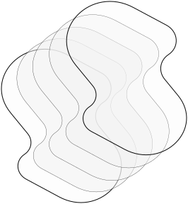

<div align="center">
  
  <h1>Prodsight AI</h1>
  <p>Modern AI-powered product insights platform built with Next.js, TypeScript, and a modular component architecture.</p>
</div>

---

## 🚀 Tech Stack

- **Framework:** [Next.js 14+](https://nextjs.org/) (App Router, Server Components)
- **Language:** TypeScript
- **Styling:** Tailwind
- **State Management:** Zustand
- **UI:** Modular, reusable components (see `src/app/components/`)
- **Auth:** Next.js Route Handlers, custom anonymous & login flows
- **Data:** Supabase (see `src/utils/supabase/`)
- **Cloud & Edge:** [Cloudflare](https://cloudflare.com/) (security, edge, DNS)
- **Other:** TanStack Query, custom hooks, Vercel optimized

---

## 🌐 Backend API

- **Base URL:** https://api.prodsight.adazol.com
- **Repository:** _Separate/private repository_
- **Tech Stack:**
   - [NestJS](https://nestjs.com/) (Node.js framework)
   - [Node.js](https://nodejs.org/) & TypeScript
   - [Gemini AI](https://ai.google.dev/gemini-api/docs) & Google GenAI
   - [Supabase](https://supabase.com/) (auth, storage, realtime)
   - [PostgreSQL](https://www.postgresql.org/)
   - [Swagger](https://swagger.io/) (OpenAPI docs)

The backend powers all product insights, authentication, and AI features. See the backend repository for setup, endpoints, and API documentation.

---

## 🛠️ Local Development

1. **Copy environment variables:**
   ```bash
   cp .env.example .env.local
   # Then fill in your local values
   ```
2. **Install dependencies:**
   ```bash
   npm install
   # or
   yarn
   ```
3. **Start the dev server:**
   ```bash
   npm run dev
   # or
   yarn dev
   ```
4. Open [http://localhost:3000](http://localhost:3000) in your browser.

---

## 📁 Project Structure

- `src/app/` — Main app, routing, and page components
- `src/app/components/` — UI components (custom & shared)
- `src/app/hooks/` — Custom React hooks
- `src/app/lib/` — Utilities and helpers
- `src/app/store/` — State management stores
- `src/app/styles/` — Global and variant CSS
- `src/utils/supabase/` — Supabase client and helpers
- `public/` — Static assets and images

---

## 🔒 Authentication

- Anonymous and email-based login supported
- See `src/app/_components/anonymous-auth-status.tsx` and `src/app/login/`

---

## 🧩 Components

- All UI is built from modular, reusable components
- See `src/app/components/custom/` and `src/app/components/shared/`

---

## 🧪 Testing & Linting

- Lint: `npm run lint`
- Type check: `npm run type-check`
- (Add your preferred testing setup)

---

## 🚀 Deployment

- Deploy on [Vercel](https://vercel.com/) for best performance
- See [Next.js deployment docs](https://nextjs.org/docs/app/building-your-application/deploying)

---

## 📄 License

MIT
